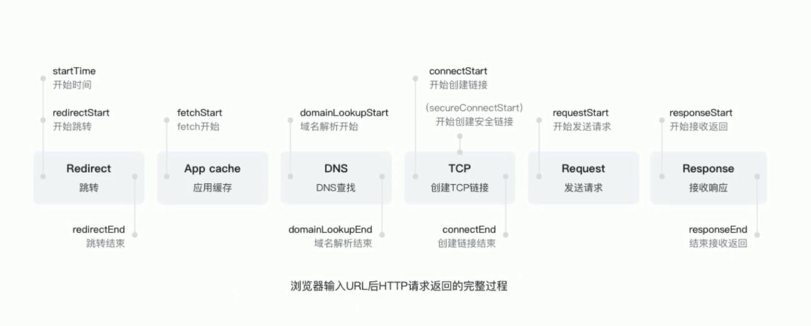
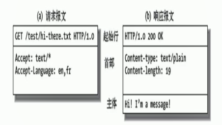

# HTTP 协议

## 浏览器的请求和返回过程



## 简介

- HTTP 协议是超文本传输协议（Hyper Text Transfer Protocol）的缩写,是用于从万维网（WWW:World Wide Web ）服务器传输超文本到本地浏览器的传送协议

- HTTP 是一个基于 TCP/IP 通信协议来传递数据（HTML 文件, 图片文件, 查询结果等）

## 工作原理

- HTTP 默认端口号为 80，但是你也可以改为其他端口。
- HTTP 是无连接的，说的就是是限制每次连接只处理一个请求。服务器处理完客户的请求，并收到客户的应答后，即断开连接。采用这种方式可以节省传输时间。
- HTTP 是媒体独立的，只要客户端和服务器知道如何处理的数据内容，任何类型的数据都可以通过 HTTP 发送。客户端以及服务器指定使用适合的 MIME-type 内容类型。
- HTTP 协议是无状态协议。无状态是指协议对于事务处理没有记忆能力。缺少状态意味着如果后续处理需要前面的信息，则它必须重传，这样可能导致每次连接传送的数据量增大。另一方面，在服务器不需要先前信息时它的应答就较快。

## 历史

- HTTP/0.9 1991 年发布；只有 Get，没有 header，服务器发送完成，就关闭 TCP 链接

- HTTP/1.0 1996 年 5 月发布；除了 GET 命令，还引入了 POST 命令和 HEAD 命令，status code 和 header，多字符集，多部分发送，权限，缓存等...

- HTTP/1.1 1997 年 1 月发布，在 1.0 基础上添加了持久链接、pipeline、添加 host 和其他命令

- SPDY ：2009 年谷歌发布 SPDY 协议，主要解决 HTTP/1.1 效率不高的问题；

- HTTP/2 ：2015 年借鉴 SPDY 的 HTTP/2 发布。所有数据用二进制传输，同一个链接就不需要按照顺序来了，头信息的压缩，以及推送效率的提高

## HTTP 的三次握手其实就是 TCP 的三次握手

1. 客户端发送 -- SYN=1,Seq=X --> 服务端
2. 服务端 -- SYN=1,ACK=X+1.Seq=Y --> 客户端
3. 客户端 -- ACK=Y+1,Seq=Z --> 服务端


## URI = URL + URN

- URI -> Uniform Resource Identifier/统一资源标识符
  1. 用来标识互联网上的信息资源
  2. 包括了 URL+URN
- URL -> Uniform Resource Locator/统一资源定位器; \[http/ftp...\]://user:pass@host.com:80/path?query=string#hash
  - http、ftp 等，是协议；
  - user:pass@,是预留的用户名密码区域
  - host.com，是服务器；
  - 80，是服务器上的默认网络端口号，默认不显示；
  - path，是路径（URI：直接定位到对应的资源）；
  - ?query=string，是查询。
  - #hash，是瞄点
- URN -> 永久统一资源定位符

## HTTP 报文



### 请求

- 起始行

  - 如：GET /test.html HTTP/1.1
  - 解释：GET <=> 方法、test.html <=> uri、 HTTP/1.1 <=> 协议/版本

- 方法：Method

  1. GET：读取（Read）
  2. POST：新建（Create）
  3. PUT：更新（Update）
  4. PATCH：更新（Update），通常是部分更新
  5. DELETE：删除（Delete)

- 首部: Head
  |字段|例子|解释|
  |Host|Host：www.baidu.com||
  |User-Agent|||
  |Accept|||

- 实体: Body， 服务端要求需要的数据

### GET 和 POST 的区别是什么

- GET 和 POST 本质上就是 TCP 链接，并无差别。但是由于 HTTP 的规定和浏览器/服务器的限制，导致他们在应用过程中体现出一些不同。

- 需要注意的是，web 中的 get/post 只是 http 中的 get/post 的子集。http 中的 get 与 post 只是单纯的名字上的区别，get 请求的数据也可以放在 request body 中，只是浏览器没有实现它，但是 get 并不只是在 web 中使用

### 响应

- 起始行

  - 如：HTTP/1.1 200 OK
  - 解释： HTTP/1.1 <=> 协议/版本、200 <=> 状态码、OK <=> 状态码消息

- 状态码和消息：Status Code and Status Code Message

- 1XX,信息性状态码(information)，表示接收的请求正在处理

  - 它的目的是对这样的情况进行优化：http 客户端应用程序有一个实体的主体部分要发送给服务器，但希望在发送之前查看一下服务器是否接受这个实体。
    |状态码|消息|解释|
    |--|--|--|
    |100|Continue|继续|
    |101|Switching Protocols|切换协议|

- 2XX,成功的状态码(Success)，表示请求正常处理完毕
  |状态码|消息|解释|
  |--|--|--|
  |200|OK|请求已成功没有问题|
  |201|Created|用于创建服务器对象的请求|
  |202|Accepted|服务器已接受请求，但尚未处理|
  |203|Non-Authoritative Information|服务器已成功处理了请求，但返回的信息可能来自另一来源|
  |204|No Content|服务器成功处理了请求，但没有返回任何内容|
  |205|Reset Content|服务器成功处理了请求，且没有返回任何内容,要求重置内容|
  |206|Partial Content|成功执行了一部分或者是执行了范围(range)请求|

- 3XX,重定向状态码(Redirection)，表示需要进行附加操作用以完成请求
  |状态码|消息|解释|
  |--|--|--|
  |300|MUltiple Choices|客户端请求指向了多个资源|
  |301|Moved Permanently|在请求的 URL 已被永久移除，响应的首部中包含新的资源现在所处的 URL|
  |302|Found|服务器目前从不同位置的网页响应请求，但请求者应继续使用原有位置来进行以后的请求|
  |303|See other|对应当前请求的响应可以在另一个 URI 上被找到|
  |304|Not Modified|自从上次请求后，请求的网页未修改过|
  |305|Use Proxy|请求者只能使用代理访问请求的网页|
  |307|Temporary Redirect|服务器目前从不同位置的网页响应请求，但请求者应继续使用原有位置来进行以后的请求|

- 4XX,客户端错误状态码(Client Error)，表示服务器无法处理请求
  |状态码|消息|
  |--|--|
  |400|Bad Request|服务器不理解请求的语法|
  |401|Unauthorized|请求要求身份验证|
  |403|Forbidden|服务器拒绝请求|
  |404|Not Found|请求没有找到|
  |405|Method Not Allowed|禁用请求中指定的方法|
  |406|Not Acceptable|无法使用请求的内容特性响应请求|
  |407|Proxy Authentication Required|指定请求者应当授权使用代理|
  |408|Request Timeout|服务器等候请求时发生超时|
  |409|Conflict|服务器在完成请求时发生冲突|
  |410|Gone|被请求的资源在服务器上已经不再可用|
  |411|Length Required|服务器拒绝在没有定义 Content-Length 头的情况下接受请求|
  |412|Precondition Failed|服务器未满足请求者在请求中设置的其中一个前提条件|
  |413|Request Entity Too Large|服务器无法处理请求，因为请求实体过大|
  |414|Request-URI Too Long|请求的 URI 长度超过了服务器能够解释的长度|
  |415|Unsupported Media Type|请求的格式不受服务器的支持|
  |416|Requested Range Not Satisfiable|页面无法提供请求的范围|
  |417|Expectation Failed|服务器未满足"期望"请求标头字段的要求|

- 5XX,服务器错误状态码(Server Error), 表示服务器处理请求出错
  |状态码|消息|
  |--|--|
  |500|Internal Server Error|服务器遇到错误，无法完成请求|
  |501|Not Implemented|服务器不具备完成请求的功能|
  |502|Bad Gateway|服务器作为网关或代理，从上游服务器收到无效响应|
  |503|Service Unavailable|服务器目前无法使用（由于超载或停机维护）|
  |504|Gateway Timeout|服务器作为网关或代理，但是没有及时从上游服务器收到请求|
  |505|HTTP Version Not Supported|服务器不支持请求中所用的 HTTP 协议版本|

- 首部：Head

- 实体：Body，服务器返回的资源

## 浏览器的跨域请求限制的解决办法

1. jsonp 跨域

   - 最早的解决方案，利用 script 标签可以跨域的原理实现。
   - 限制：需要服务的支持，只能发起 GET 请求，而且容易造成 XSS 漏洞

2. nginx 反向代理

   - 利用 nginx 反向代理把跨域为不跨域，支持各种请求方式
   - 缺点：需要在 nginx 进行额外配置，语义不清晰

3. CORS 跨域
   - 规范化的跨域请求解决方案，安全可靠。
   - 在服务端进行控制是否允许跨域，可自定义规则，支持各种请求方式
   - 缺点：会产生额外的一些请求

### jsonp 实现跨域

```html
<script src="http://localhost:8888?query=123"></script>
```

### 实现 CORS 跨域

- [阮一峰](http://www.ruanyifeng.com/blog/2016/04/cors.html)

1. 请求方法是以下三种方法之一：

   - HEAD
   - GET
   - POST

2. HTTP 的头信息不超出以下几种字段：
   - Accept
   - Accept-Language
   - Content-Language
   - Last-Event-ID
   - Content-Type：只限于三个值 application/x-www-form-urlencoded、multipart/form-data、text/plain
3. XMLHttpRequestUpload 对象没有注册任何事件的监听、请求中没有使用 ReadableStream 对象

```js
const http = require('http')

http.createServer((request,response)=>{
  // 设置所有域名可跨域的响应头
  // * 表示所有域名
  // http://172.20.0.206 指定允许其他域名访问
  // 要实现多个可以跨域，就需要通过判断request的host来动态写入

  response.writeHead(200,{
    //一般用法（*，指定域，动态设置），3是因为*不允许携带认证头和cookies
    'Access-Control-Allow-Origin':'http://172.20.0.206',
    //是否允许后续请求携带认证信息（cookies）,该值只能是true,否则不返回
    'Access-Control-Allow-Credentials':'true',
    // 允许自定义头等
    'Access-Control-Allow-Headers':'X-Test-Cors',
    // 允许方法
    'Access-Control-Allow-Methods':'GET, POST, PUT',
    // 请求的最长时间
    'Access-Control-Allow-Max-Age': '1000',
  })
  // 返回
  response.end('请求OK')
}).listen(8888)

console.log('服务器地址：localhost:8888')
```

## 缓存(强缓存和协商缓存)

- [CSDN](https://blog.csdn.net/jutal_ljt/article/details/80021545)

1. `Expire`表示在这个日期/时间之后，HTTP 响应被认为是过时的。但是它本身是一个 HTTP1.0 标准下的字段，所以如果请求中还有一个置了 “max-age” 或者 “s-max-age” 指令的 Cache-Control 响应头，那么 Expires 头就会被忽略。
2. `Cache-Control` 通用消息头用于在 http 请求和响应中通过指定指令来实现缓存机制。其常用的几个取值有：
   - `private`: 只有客户端可以缓存
   - `public`: 客户端和代理服务器都可以进行缓存
   - `max-age=xxx`: 缓存的内容将在 xxx 秒后失效
   - `s-max-age=xxx`: 同 max-age，但仅适用于共享缓存(比如各个代理)，并且私有缓存中忽略
   - `max-stale=xxx`: 表示即使 max-age 过期但是还在 max-stale 时间内，也还可以使用缓存
   - `no-cache`: 需要使用协商缓存来验证缓存数据
   - `no-store`: 所有内容都不会缓存，强缓存和协商缓存都不会触发
   - `must-revalidate`: 缓存必须在使用之前验证旧资源的状态，并且不可使用过期资源
   - `proxy-revalidate`: 同 `must-revalidate ，是用在缓存服务器中的
   - `no-transform`: 告诉代理服务器不要改动内容，禁止转码方式

### 通过设置文件的 hash 码来组成 url 达到浏览器长缓存效果，比如：script.js?hash 码

### 缓存验证 Last-Modified 和 Etag


#### Last-Modified 上次修改时间

- 配合 If-Modified-Since 或者 If-Unmodified-Since 使用
- 对比上次修改时间判断是否需要进行更新

```js
// 服务端
'Last-Modified': 123
// 客户端下次请求携带
'If-Modified-Since':123
```

#### Etag

- 数据签名，比如：hash 计算
- 配合 If-Match 或者 If-Non-Match 使用
- 对比资源的签名是否需要使用缓存

```js
// 服务端
'Etag': 777
// 客户端下次请求携带
'If-Non-Match':777
```

### 总结

- 强缓存：

  - **`Expires`** 或 **`Cache-Control`**

- 协商缓存：

  - 第一对：`Last-Modified`、`If-Modified-Since`

  - 第二对：`ETag`、`If-None-Match`

## Cookies 和 Session

### Cookie

- HTTP 响应通过 Set-Cookie 设置 Cookie

- 浏览器访问指定域名是必须带上 Cookie 作为 Request Header

- Cookie 一般用来记录用户信息

- max-age 和 expires 设置过期时间

- Secure 只在 Https 的时候发送

- HttpOnly 无法通过 document.cookie 访问

```js
// 设置多个Cookie，id时间100秒,key无法通过document.cookie访问
// key 设置域名Domain:test.com
'Set-Cookie':['id=123;max-age=100','key=456;HttpOnly;domain=test.com']
```

### Session

- Session 是服务器端的内存（数据）

- session 一般通过在 Cookie 里记录 SessionID 实现

- SessionID 一般是随机且不重复的数

## 跨域认证解决方案 JSON Web Token

- [阮一峰](http://www.ruanyifeng.com/blog/2018/07/json_web_token-tutorial.html)

## LocalStorage 和 Cookie 的区别是什么

- Cookie 会随请求被发到服务器上，而 LocalStorage 不会

- Cookie 大小一般 4k 以下，LocalStorage 一般 5Mb 左右

## HTTP 长连接(默认的) `'Connection':'keep-alive'`

- 关闭,服务端设置: `'Connection':'close'`

## 数据协商

- 数据类型 Accept
- 编码 Accept-Encoding
- 语言 Accept-Language
- 标识 User-Agent
- 内容类型 Content-type
- 内容编码 Content-Encoding: 'gzip'压缩等，node可以使用zlib官方包
- 内容语言 Content-Language

## 重定向 Redirect ，301 和 302 的区别

- 301 永久重定向，浏览器会记住（有缓存）

- 302 临时重定向（无缓存）

## CSP(Content-Security-Policy)内容安全策略

- [MDN](https://developer.mozilla.org/zh-CN/docs/Web/Security/CSP)

- 限制资源获取，报告资源获取越权
- 限制方式
- default-src 限制全局
- 制定资源类型：connect-src，img-src，manifest-src，font-src，media-src，style-src，frame-src，script-src...

```js
// 只使用http，https的资源
'Content-Security-Policy':'default-src http: https:'
// 限制只使用当前域名的资源
'Content-Security-Policy':'default-src \'self\''
// 限制表单提交
'Content-Security-Policy':'default-src \'self\'; form-action \'self\''
// 发送报告
'Content-Security-Policy': 'report-uri /report'
// 可以加载并且发送报告
'Content-Security-Policy-Report-Only':'report-uri /report'
// 服务器处理
request.url === '/report'
```

### HTML 里面也可以写

```html
<meta http-equiv="Content-Security-Policy" content=”default-src ‘self’;form-action ’self‘;report-uri /report “>
```

## HTTPS


### 证书生成

```sh
openssl req -x509 -newkey rsa:2048 -nodes -sha256 -keyout localhost-privkey.pem -out localhost-cert.pem
```

### 加密传输

1. 私钥(服务器)
2. 公钥(客户端)

## HTTP2

1. 信道的复用
2. 分帧传输
3. Server Push

```conf
// nginx 配置，必须使用https
listen  443 http2;
http2_push_preload on;

```

## 参考文章

- [百度百科](https://baike.baidu.com/item/HTTP%E7%8A%B6%E6%80%81%E7%A0%81)
