# win 安装通过 nvm 版本管理器安装 node、npm、yarn，以及常用命令使用

> **版权声明**： 转载请带上它：

## 第一步: GitHub 下载: [https://github.com/coreybutler/nvm-windows/releases](https://github.com/coreybutler/nvm-windows/releases)

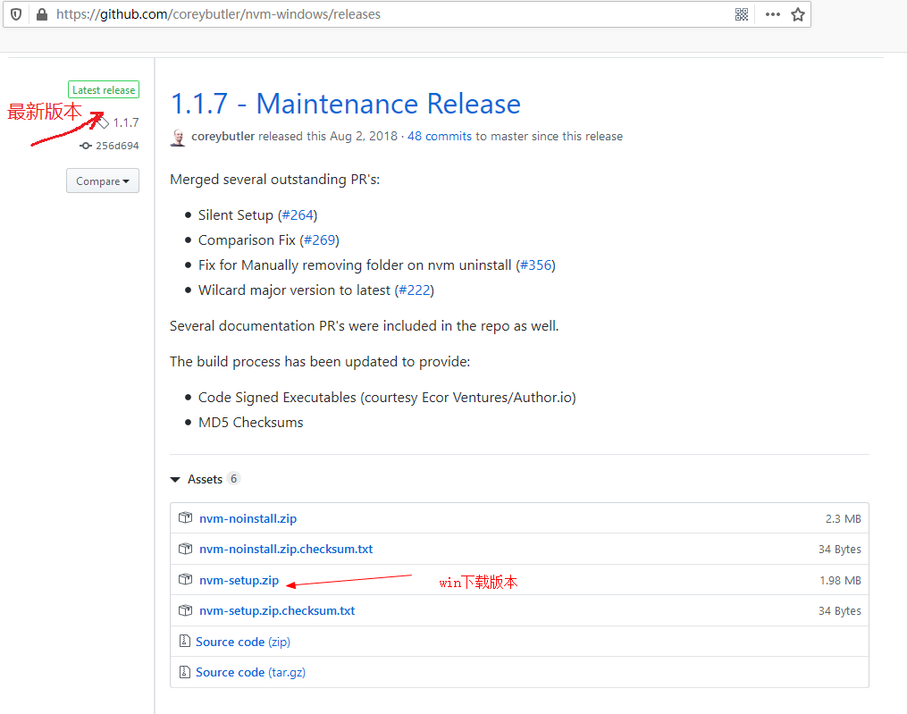

## 第二步: 安装

### 一、同意协议

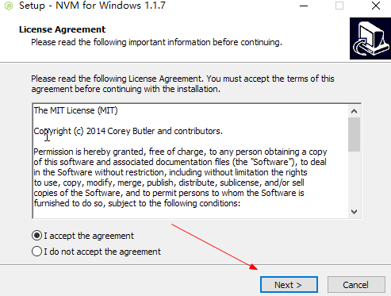

### 二、选择 nvm 路径

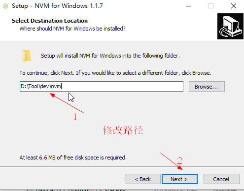

### 一、选择 nodejs 路径

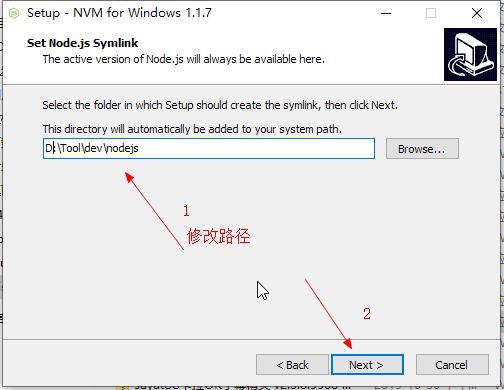

### 四、开始安装

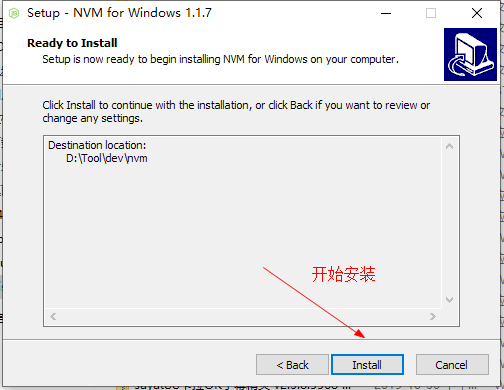

### 一、安装完成

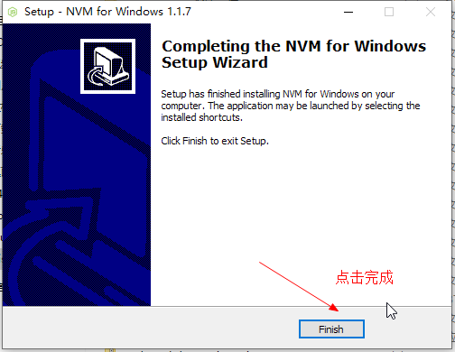

### 六、安装确认

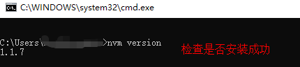

## 第三步：配置 nvm、安装node、nrm(管理源),配置文件在安装目录下[settings.txt](../config/settings.txt)可以直接更改）

1. `nvm arch 64` 配着默认环境为 64 位，(电脑 64 位的)
2. `nvm node_mirror https://npm.taobao.org/mirrors/node/` 设置 node 下载源为淘宝
3. `nvm npm_mirror https://npm.taobao.org/mirrors/npm/` 设置 npm 下载源为淘宝
4. `nvm install 版本号` 安装指定版本的 node
5. `nvm user 版本号` 设置指定版本的 node
6. `cd D:\Tool\dev\nvm\` 打开(nvm 的安装安装路径)
7. `mkdir package_global`
8. `mkdir package_cache`
9. `mkdir package_tmp`
10. `npm config set prefix "D:\Tool\dev\nvm\package_global"` 配置全局包位置
11. `npm config set cache "D:\Tool\dev\nvm\package_cache"` 配置包缓存路径
12. `npm config set tmp "D:\Tool\dev\nvm\package_tmp"` 配置临时目录(可以不用配置,默认C盘的temp下)
13. `%NVM_HOME%\package_global`  添加系统环境变量Path中(文章最后有详细图)
14. `npm install -g nrm` 安装nrm源管理
15. `nrm -V` 查看nrm版本确认安装成功
16. `nrm use taobao` 配着源为 taobao

> 更多详细命令查看[链接](./page/cmd.md)

## 常见安装报错解决方案，请先检查环境变量

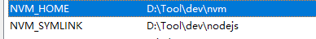
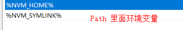

> CURRENT  <--> 测试版
> LTS  <-->  稳定版(长期支持版)
> OLD STABLE <--> 过去稳定版
> OLD UNSTABLE  <--> 过去测试版

- 版本标题说明图

> 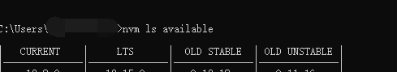

- 设置当前版本图

> 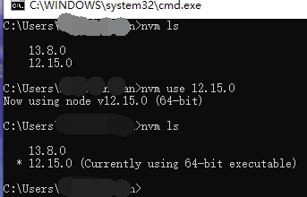
